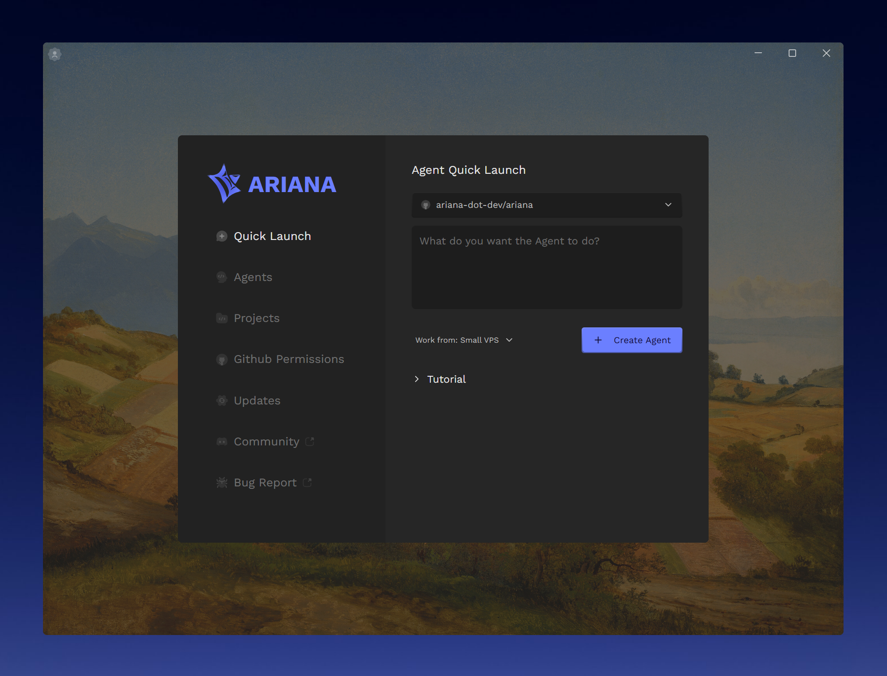

  <h1 align="center">Ariana</h1>
  
   
  
<i>Collaborative Workspace for your Coding Agents.</i>

  

    
    
  

# Ariana Issues Repository

This repository is for tracking issues related to Ariana.

It also contains the code for the Ariana IDE (ancestor project of Ariana) released under the GNU Affero General Public License v3.0.

It will also contain future open source projects related to Ariana if deemed appropriate.
