# Ariana Features & User Funnels Graph

```mermaid
graph TB
    Start[App Launch<br/>main.tsx:App] --> Auth[GitHub Authentication<br/>.tsx:handleGitHubLogin]

    Auth --> Session[Authenticated Session<br/>useAppStore.ts:setUser]

    Session --> MainMenu[Main Menu<br/>MainMenu.tsx]

    %% Main Menu Tabs
    MainMenu --> ProjectsTab[Projects Tab<br/>ProjectsTab.tsx]
    MainMenu --> AgentsTab[All Agents Tab<br/>AllAgentsPanel.tsx]
    MainMenu --> PermissionsTab[GitHub Permissions<br/>PermissionsTab.tsx]
    MainMenu --> UpdatesTab[Updates Tab<br/>UpdatesTab.tsx]

    %% Settings Dropdown
    Session --> Settings[Settings Dropdown<br/>AccountDropdown.tsx]
    Settings --> ChangeTheme[Change Theme<br/>useAppStore.ts:setTheme]
    Settings --> ManageProviders[Manage Providers<br/>AgentProvidersDialog.tsx]
    Settings --> SignOut[Sign Out<br/>auth.ts:signOut]
    Settings --> ResetData[Reset Local Data<br/>useAppStore.ts:reset]

    ManageProviders --> ConfigureOAuth[Setup Claude OAuth<br/>useClaudeCodeProviderActions.ts]
    ManageProviders --> ConfigureAPIKey[Setup API Key<br/>useClaudeCodeProviderActions.ts]

    %% Projects Tab
    ProjectsTab --> SearchProjects[Search Projects<br/>ProjectsTab.tsx:searchTerm]
    ProjectsTab --> CreateFromGitHub[New from GitHub<br/>ProjectsTab.tsx:handleOpenFromGithub]
    ProjectsTab --> CreateFromLocal[New from Local<br/>ProjectsTab.tsx:handleOpenFolder]
    ProjectsTab --> OpenExisting[Open Existing Project<br/>ProjectsTab.tsx:handleOpenProjectWorkspace]

    CreateFromGitHub --> GithubSearch[Search Repository<br/>GithubRepoSearchModal.tsx]
    GithubSearch --> SelectRepo[Select Repository<br/>useGithubRepoSearch.ts:handleSelectRepository]

    CreateFromLocal --> FilePicker[Pick Folder<br/>project.service.ts:openLocalFolder]

    SelectRepo --> ProjectView[Project View<br/>ProjectView.tsx]
    OpenExisting --> ProjectView
    FilePicker --> ProjectView

    %% Project View - Repository Linking
    ProjectView --> CheckGithubLink{Has GitHub Link?<br/>project-link.service.ts:checkAndLinkRepository}
    CheckGithubLink -->|No Link| PromptLink[Prompt to Link<br/>project-link.service.ts]
    CheckGithubLink -->|Already Linked| ProjectViewContent
    PromptLink -->|User Accepts| LinkRepo[Link to GitHub<br/>handlers.ts:handleCheckAndLinkRepository]
    PromptLink -->|User Declines| ProjectViewContent
    LinkRepo --> ProjectViewContent[Agent Manager<br/>ProjectViewContent.tsx]

    %% Agent Manager
    ProjectViewContent --> AgentsList[Agents Sidebar<br/>AgentSidebar.tsx]
    ProjectViewContent --> SpecsList[Specifications Sidebar<br/>SpecificationsSidebar.tsx]

    %% Agents Sidebar
    AgentsList --> CreateAgent[Click New Agent<br/>ProjectViewContent.tsx:createAgent]
    AgentsList --> SelectAgent[Select Agent<br/>ProjectViewContent.tsx:setSelectedAgent]
    AgentsList --> DeleteAgent[Delete Agent<br/>ProjectViewContent.tsx:handleAgentDelete]

    %% Agent Configuration Dialog
    CreateAgent --> ConfigDialog[Agent Config Dialog Opens<br/>AgentConfigDropdown.tsx]

    ConfigDialog --> ChooseSource{Choose Source Type<br/>AgentConfigDropdown.tsx:setSelectedSource}
    ChooseSource -->|local project files| SourceLocal[Work from Local Code<br/>config.source.from = 'local']
    ChooseSource -->|GitHub branch| SourceBranch[Work from GitHub Branch<br/>config.source.from = 'branch']

    %% GitHub Branch Flow
    SourceBranch --> CheckRepoAccess{Has Repository Access?<br/>AgentConfigDropdown.tsx:hasRepositoryId}
    CheckRepoAccess -->|Yes| SelectBranch[Select/Search Branch<br/>BranchSelector.tsx:setSelectedBranch]
    CheckRepoAccess -->|No| DetectRemote{GitHub Remote Detected?<br/>git.rs:get_github_remote_url}

    DetectRemote -->|Yes| GrantPermissions[Grant Permissions<br/>AgentConfigDropdown.tsx:handleChangePermissions]
    DetectRemote -->|No| CannotUseBranch[Branch Option Disabled]

    GrantPermissions --> PollAccess[Poll for Access<br/>AgentConfigDropdown.tsx:startPollingForAccess]
    PollAccess --> AccessGranted{Access Granted?}
    AccessGranted -->|Yes| SelectBranch
    AccessGranted -->|Still Waiting| PollAccess

    SelectBranch --> BranchPicked[Branch Selected<br/>default: main or user pick]

    %% Both paths converge to provider & machine selection
    SourceLocal --> ChooseProvider[Choose Agent Provider<br/>AgentProviderSelector.tsx:setSelectedProvider]
    BranchPicked --> ChooseProvider

    ChooseProvider --> ProviderPicked{Provider Ready?<br/>useAgentProviders.ts:isReady}
    ProviderPicked -->|Not Ready| SetupProvider[Setup Credentials<br/>ClaudeProviderConfig.tsx]
    SetupProvider --> ProviderReady[Provider Configured]
    ProviderPicked -->|Ready| ProviderReady

    ProviderReady --> ChooseMachine[Choose Machine Type<br/>AgentConfigDropdown.tsx:setSelectedMachine]
    ChooseMachine --> MachineSelected[Machine Type Picked<br/>cx43, cx32, etc.]

    MachineSelected --> ValidConfig{All Valid?<br/>isConfigurationValid}
    ValidConfig -->|Yes| CreateButton[Create Agent Button Enabled<br/>AgentConfigDropdown.tsx:handleConfirm]
    ValidConfig -->|No| ConfigDialog

    CreateButton --> StartProvisioning[Start Agent Creation<br/>agent.service.ts:createAndStartAgent]

    %% Agent States
    StartProvisioning --> StateProvisioning[State: PROVISIONING<br/>agent.service.ts]
    StateProvisioning --> StateProvisioned[State: PROVISIONED<br/>VPS ready]
    StateProvisioned --> StateCloning[State: CLONING<br/>Cloning repository]
    StateCloning --> StateReady[State: READY<br/>Agent ready for prompts]
    StateReady --> StateIdle[State: IDLE<br/>Waiting for prompts]
    StateIdle --> StateRunning[State: RUNNING<br/>Processing prompt]
    StateRunning --> StateIdle
    StateRunning --> StateError[State: ERROR<br/>Failed execution]

    %% Agent Chat (after agent selected)
    SelectAgent --> AgentChat[Agent Chat<br/>AgentChat.tsx]
    StateIdle --> AgentChat

    %% Agent Chat Features
    AgentChat --> ViewHistory[View Chat History<br/>AgentChat.tsx:EventsGroup]
    AgentChat --> ComposeLPrompt[Compose Prompt<br/>PromptInput.tsx]
    AgentChat --> InterruptAgent[Interrupt Agent<br/>AgentChat.tsx:interruptAgent]
    AgentChat --> ToggleSync[Toggle File Sync<br/>AgentSyncHeader.tsx:handleToggleSync]
    AgentChat --> ToggleNetwork[Toggle Network<br/>AgentSyncHeader.tsx:handleToggleNetwork]
    AgentChat --> OpenTerminals[Open Terminals<br/>BottomTerminalPanel.tsx]

    %% Compose Prompt Flow
    ComposeLPrompt --> AddMentions[Add Mentions<br/>PromptInput.tsx:handleAddMentionToInput]
    AddMentions --> MentionFiles[Mention Files<br/>useMentions.ts:MentionType.FILE]
    AddMentions --> MentionIssues[Mention GitHub Issues<br/>useMentions.ts:MentionType.ISSUE]

    ComposeLPrompt --> SendPrompt[Send Prompt<br/>AgentChat.tsx:handleSendPrompt]
    SendPrompt --> BackendPrompt[Queue Prompt<br/>handlers.ts:handleSendPrompt]

    %% History & Events
    ViewHistory --> ViewPrompts[View Prompts<br/>EventsGroup.tsx:PromptEvent]
    ViewHistory --> ViewResponses[View Responses<br/>EventsGroup.tsx:ResponseEvent]
    ViewHistory --> ViewTools[View Tool Uses<br/>EventsGroup.tsx:ToolDisplay]
    ViewHistory --> ViewCheckpoints[View Git Checkpoints<br/>EventsGroup.tsx:GitCheckpoint]

    %% Tool Interactions
    ViewTools --> HoverTool[Hover Tool<br/>BaseToolDisplay.tsx]
    ViewTools --> ClickTool[Click to Expand Tool<br/>BaseToolDisplay.tsx:setIsExpanded]
    ClickTool --> ViewToolDetails[View Tool Details<br/>Collapsed → Expanded]

    %% Checkpoint Interactions
    ViewCheckpoints --> HoverCheckpoint[Hover Checkpoint<br/>GitCheckpoint.tsx:setHovering]
    HoverCheckpoint --> CheckpointMenu[Checkpoint Menu Appears<br/>DropdownMenu]
    CheckpointMenu --> RevertCheckpoint[Revert to Checkpoint<br/>GitCheckpoint.tsx:handleRevert]
    CheckpointMenu --> OpenInGithub[Open in GitHub<br/>GitCheckpoint.tsx:handleViewCommit]

    %% File Sync Flow
    ToggleSync --> SyncDialog{Show Sync Dialog<br/>AgentSyncHeader.tsx}
    SyncDialog --> ViewDiffs[View File Diffs<br/>useAgentSync.ts:diffNotifications]
    ViewDiffs --> UserDecision{User Decision}
    UserDecision -->|Don't Sync| CancelSync[Cancel Sync]
    UserDecision -->|Start Syncing| StartBidirectionalSync[Start Bidirectional Sync<br/>useAgentSync.ts:startSync]

    StartBidirectionalSync --> SyncActive[Sync Active<br/>Automatic polling every 2s]
    SyncActive --> UserStopsSync{User Stops Sync?<br/>AgentSyncHeader.tsx:stopSync}
    UserStopsSync -->|Yes| EndSync[End Sync Session]
    UserStopsSync -->|No| SyncActive

    %% Network Forwarding Flow
    ToggleNetwork --> NetworkMenu{Network Menu<br/>AgentSyncHeader.tsx:DropdownMenu}
    NetworkMenu --> StartForwarding[Start Forwarding<br/>useNetworkForwarding.ts:startForwarding]
    NetworkMenu --> StopForwarding[Stop Forwarding<br/>useNetworkForwarding.ts:stopForwarding]

    StartForwarding --> DetectPorts[Detect Dev Ports<br/>port-bridge.service.ts:fetchPorts]
    DetectPorts --> EstablishTunnels[Establish SSH Tunnels<br/>ssh_tunnel.rs:establish_ssh_tunnel]
    EstablishTunnels --> ForwardingActive[Forwarding Active<br/>Ports accessible on localhost]

    ForwardingActive --> TogglePortPublic{Port on 0.0.0.0?}
    TogglePortPublic -->|Yes| AllowPublicAccess[Allow Public Access<br/>AgentSyncHeader.tsx:handlePortVisibilityChange]
    TogglePortPublic -->|Yes| DisablePublicAccess[Disable Public Access<br/>AgentSyncHeader.tsx:handlePortVisibilityChange]

    AllowPublicAccess --> PortPublic[Port Publicly Accessible<br/>port-handlers.ts:handleSetPortVisibility]
    DisablePublicAccess --> PortPrivate[Port Blocked by Firewall]

    %% Terminals
    OpenTerminals --> CreateTerminalConn[Create Terminal<br/>TerminalComponent.tsx:createConnection]
    CreateTerminalConn --> SSHTerminal[SSH Terminal Session<br/>terminal.rs:create_terminal_connection]
    SSHTerminal --> SendTerminalInput[Send Terminal Input<br/>TerminalComponent.tsx:write]
    SSHTerminal --> CloseTerminal[Close Terminal<br/>TerminalComponent.tsx:dispose]

    %% Specifications
    SpecsList --> CreateSpec[Create Specification<br/>SpecificationsSidebar.tsx:onAdd]
    SpecsList --> EditSpec[Edit Specification<br/>SpecificationsSidebar.tsx:onEdit]
    SpecsList --> DeleteSpec[Delete Specification<br/>SpecificationsSidebar.tsx:onDelete]
    SpecsList --> ViewSpec[View Specification<br/>SpecificationsSection.tsx:toggleSpecExpansion]

    %% All Agents Tab
    AgentsTab --> SearchAllAgents[Search All Agents<br/>AllAgentsPanel.tsx:searchTerm]
    AgentsTab --> SelectAgentFromAll[Select Agent<br/>AllAgentsPanel.tsx:handleAgentClick]
    SelectAgentFromAll --> ProjectView

    %% Permissions Tab
    PermissionsTab --> ViewInstallations[View Installations<br/>PermissionsTab.tsx:installations]
    PermissionsTab --> ChangePermissions[Change Permissions<br/>PermissionsTab.tsx:handleChangePermissions]
    PermissionsTab --> RefreshPermissions[Refresh Permissions<br/>PermissionsTab.tsx:fetchGroupedInstallations]

    %% Updates Tab
    UpdatesTab --> CheckUpdates[Check for Updates<br/>UpdatesTab.tsx:checkForUpdate]
    CheckUpdates --> InstallUpdate[Install Update<br/>UpdatesTab.tsx:installUpdate]

    %% Styling
    classDef entryPoint fill:#ff6b6b,stroke:#c92a2a,color:#fff
    classDef userAction fill:#4ecdc4,stroke:#0a9396,color:#fff
    classDef dialog fill:#ffd93d,stroke:#f4a261,color:#000
    classDef state fill:#a8dadc,stroke:#457b9d,color:#000
    classDef technical fill:#95e1d3,stroke:#38a3a5,color:#000
    classDef config fill:#b8e6b8,stroke:#52a352,color:#000

    class Start,Auth entryPoint
    class CreateAgent,SelectAgent,SendPrompt,ToggleSync,ToggleNetwork,AddMentions,UserDecision,UserStopsSync,TogglePortPublic,ChooseSource,SelectBranch,ChooseProvider,ChooseMachine,ClickTool,HoverCheckpoint,RevertCheckpoint,OpenInGithub userAction
    class ConfigDialog,SyncDialog,NetworkMenu,ViewDiffs,CheckGithubLink,CheckRepoAccess,DetectRemote,AccessGranted,ProviderPicked,ValidConfig,CheckpointMenu dialog
    class StateProvisioning,StateProvisioned,StateCloning,StateReady,StateIdle,StateRunning,StateError state
    class SyncActive,ForwardingActive,SSHTerminal,HoverTool technical
    class SourceLocal,SourceBranch,BranchPicked,SetupProvider,ProviderReady,MachineSelected,CreateButton config
```



---

## Feature Entry Points Reference

### Authentication
- **Entry**: `frontend/src/components/.tsx:handleGitHubLogin()`
- **Backend**: `backend/src/api/auth/handlers.ts:handleSignIn()`

### Projects Management
- **Create from GitHub**: `frontend/src/components/main-menu/ProjectsTab.tsx:handleOpenFromGithub()`
- **Create from Local**: `frontend/src/services/project.service.ts:openLocalFolder()`
- **Open Project**: `frontend/src/components/main-menu/ProjectsTab.tsx:handleOpenProjectWorkspace()`

### Agent Management
- **Open Config Dialog**: `frontend/src/components/agent-manager/AgentConfigDropdown.tsx`
- **Choose Source Type**: `frontend/src/components/agent-manager/AgentConfigDropdown.tsx:setSelectedSource()`
- **Select Branch**: `frontend/src/components/BranchSelector.tsx:setSelectedBranch()`
- **Choose Provider**: `frontend/src/components/agent-manager/AgentProviderSelector.tsx:setSelectedProvider()`
- **Choose Machine**: `frontend/src/components/agent-manager/AgentConfigDropdown.tsx:setSelectedMachine()`
- **Validate Config**: `frontend/src/components/agent-manager/AgentConfigDropdown.tsx:isConfigurationValid()`
- **Create Agent**: `frontend/src/services/agent.service.ts:createAndStartAgent()`
- **Delete Agent**: `frontend/src/hooks/useAgents.ts:deleteAgent()`
- **Select Agent**: `frontend/src/components/ProjectViewContent.tsx:setSelectedAgent()`

### Agent Chat
- **Send Prompt**: `frontend/src/components/agent-chat/AgentChat.tsx:handleSendPrompt()`
- **Interrupt**: `frontend/src/hooks/useEvents.ts:interruptAgent()`
- **Add Mentions**: `frontend/src/hooks/useMentions.ts:handleAddMentionToInput()`
- **Expand Tool**: `frontend/src/components/agent-chat/tools/BaseToolDisplay.tsx:setIsExpanded()`
- **Revert Checkpoint**: `frontend/src/components/agent-chat/GitCheckpoint.tsx:handleRevert()`
- **View Commit**: `frontend/src/components/agent-chat/GitCheckpoint.tsx:handleViewCommit()`

### File Sync
- **Toggle Sync**: `frontend/src/components/agent-chat/AgentSyncHeader.tsx:handleToggleSync()`
- **Start Sync**: `frontend/src/hooks/useAgentSync.ts:startSync()`
- **Stop Sync**: `frontend/src/hooks/useAgentSync.ts:stopSync()`
- **Backend Compare**: `backend/src/api/agents/sync-handlers.ts:handleCompareHashes()`

### Network Forwarding
- **Toggle Forwarding**: `frontend/src/hooks/useNetworkForwarding.ts:startForwarding()`
- **Set Port Visibility**: `frontend/src/services/port-bridge.service.ts:setPortVisibility()`
- **Backend Handler**: `backend/src/api/agents/port-handlers.ts:handleSetPortVisibility()`

### Terminals
- **Create Terminal**: `frontend/src/terminal/TerminalService.ts:createConnection()`
- **Tauri Handler**: `frontend/src-tauri/src/terminal_commands.rs:create_terminal_connection()`

### Specifications
- **Create**: `frontend/src/hooks/useSpecifications.ts:createSpec()`
- **Update**: `frontend/src/hooks/useSpecifications.ts:updateSpec()`
- **Delete**: `frontend/src/hooks/useSpecifications.ts:handleDelete()`
- **Backend**: `backend/src/api/projects/specification-handlers.ts`

### Settings
- **Change Theme**: `frontend/src/stores/useAppStore.ts:setTheme()`
- **Manage Providers**: `frontend/src/components/AgentProvidersDialog.tsx`
- **Sign Out**: `frontend/src/lib/auth.ts:signOut()`
- **Reset Data**: `frontend/src/stores/useAppStore.ts:reset()`

### GitHub Permissions
- **View Installations**: `frontend/src/components/main-menu/PermissionsTab.tsx:fetchGroupedInstallations()`
- **Backend**: `backend/src/api/github/handlers.ts:handleGetGroupedInstallations()`

---

## Primary User Funnels

### 1. New User Onboarding
```
App Launch → GitHub Auth → Setup Provider (OAuth/API Key) →
Create Project from GitHub → Create Agent → Send First Prompt
```

### 2. Agent Collaboration
```
Open Project → Click "New Agent" → Config Dialog Opens →
Choose Source Type: "local project files" OR "GitHub branch" →
[If GitHub branch:
  - If no access: Grant Permissions → Poll → Access Granted
  - Select/Search Branch (or default to main)] →
Choose Agent Provider (Claude Code) →
[If not ready: Setup Credentials → Provider Ready] →
Choose Machine Type (cx43, cx32, etc.) →
Click "Create Agent" →
[Wait through States: PROVISIONING → PROVISIONED → CLONING → READY → IDLE] →
Compose Prompt with Mentions → Send Prompt →
Monitor Events → Review Checkpoints → Revert if Needed
```

### 3. File Sync Workflow
```
Agent Chat → Click "Files Syncing" → View Diff Dialog →
Decision Point: "Don't Sync" or "Start Syncing" →
If Start: Bidirectional Sync Active → Work → Click "Stop Sync"
```

### 4. Network Development
```
Agent Chat → Click "Network" → Click "Start Forwarding" →
Ports Detected → Access on localhost →
[Optional] For public ports: "allow anyone to access" →
Access via public IP → "disable public access" when done
```

### 5. Terminal Access
```
Agent Chat → Click Terminal Icon → Terminal Opens →
SSH Connection Established → Execute Commands → Close Terminal
```

---

## Drop-off Points (User Decision Points)

1. **Auth Flow**: Manual token entry (if deep links fail)
2. **Project Creation**: GitHub vs Local folder
3. **GitHub Linking**: Accept or decline linking local project to GitHub
4. **Agent Source Type**: "local project files" vs "GitHub branch"
5. **GitHub Permissions**: Grant access or abandon branch option
6. **Branch Selection**: Search/pick branch or use default
7. **Provider Setup**: OAuth vs API Key choice, or abandon if not ready
8. **Machine Type**: Choose server size (affects performance & cost)
9. **Sync Dialog**: "Don't Sync" vs "Start Syncing"
10. **Port Visibility**: Keep private vs allow public access
11. **Agent State Failures**: PROVISIONING → ERROR, CLONING → ERROR
12. **Revert Checkpoint**: Risk of losing work
13. **Reset Local Data**: Destructive action confirmation

---

## State Transitions (High Failure Risk)

### Agent States Flow
```
PROVISIONING (VPS creation - can fail) →
PROVISIONED (VPS ready) →
CLONING (Git clone - can fail if no access) →
READY (Environment setup) →
IDLE (Waiting for work) ⟷ RUNNING (Processing) →
ERROR (Any failure point)
```

### Prompt States
```
queued → running → finished
```
