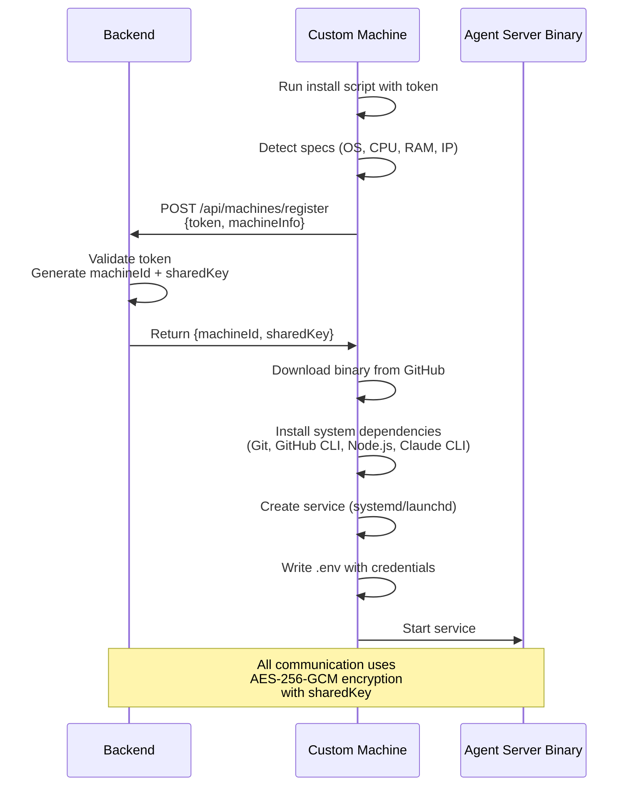

The agent server is a standalone binary that runs on custom machines, enabling them to execute Ariana agents. This document explains the architecture, installation process, and security model.

## Installation



## Installation Process

### Binary Installation

**Binary composition:**
- Bun runtime
- TypeScript code (compiled)
- npm dependencies
- Embedded Rust watcher (base64-encoded)

Downloaded from: [https://github.com/ariana-dot-dev/agent-server/releases](https://github.com/ariana-dot-dev/agent-server/releases)

Installed to: `/opt/ariana-agent/ariana-agents-server`

### System Dependencies

The install script ensures these are available:

**Always installed:**
- Git (version control)
- GitHub CLI (`gh`) - for PR creation, issue management
- Node.js + npm (runtime for tools)
- Claude Code CLI (`claude`) - AI coding assistant
- Network tools: `ss` or `netstat` (Linux only)

**Installed on-demand:**
- Project-specific dependencies per agent requirements

### Service Setup

The agent server runs as a system service that starts on boot and automatically restarts on failure.

**Linux (systemd):**
- Runs as `ariana` user (non-root)
- Logs to systemd journal

**macOS (launchd):**
- Runs as the actual user who installed (not root)
- Logs to `/var/log/ariana-agent.log`

**CLI access:**
When installed via CLI, logs are accessible through:
- `ariana logs` - View recent logs
- `ariana follow-logs` - Stream logs in real-time

### Environment Configuration

File: `/opt/ariana-agent/.env`

```bash
MACHINE_ID=mch_abc123...
SHARED_KEY=64-char-hex-string
ARIANA_PORT=8911
WORK_DIR=/home/ariana  # or /Users/username on macOS
CLAUDE_PATH=/usr/local/bin/claude
IS_SANDBOX=1
```

**Variable purposes:**
- `MACHINE_ID`: Identifies this machine in backend database
- `SHARED_KEY`: Used for AES-256-GCM encryption
- `ARIANA_PORT`: Port the agent server listens on (default 8911)
- `WORK_DIR`: Directory where agents clone repositories
- `CLAUDE_PATH`: Path to Claude CLI binary
- `IS_SANDBOX`: Flag indicating sandboxed environment

## Security Model

### Encryption

All communication between the backend and agent server uses AES-256-GCM encryption.

## Firewall Configuration

The install script configures firewall rules to allow inbound connections:

**Linux (ufw):**
```bash
ufw allow 8911/tcp
```

**Linux (firewalld):**
```bash
firewall-cmd --permanent --add-port=8911/tcp
firewall-cmd --reload
```
