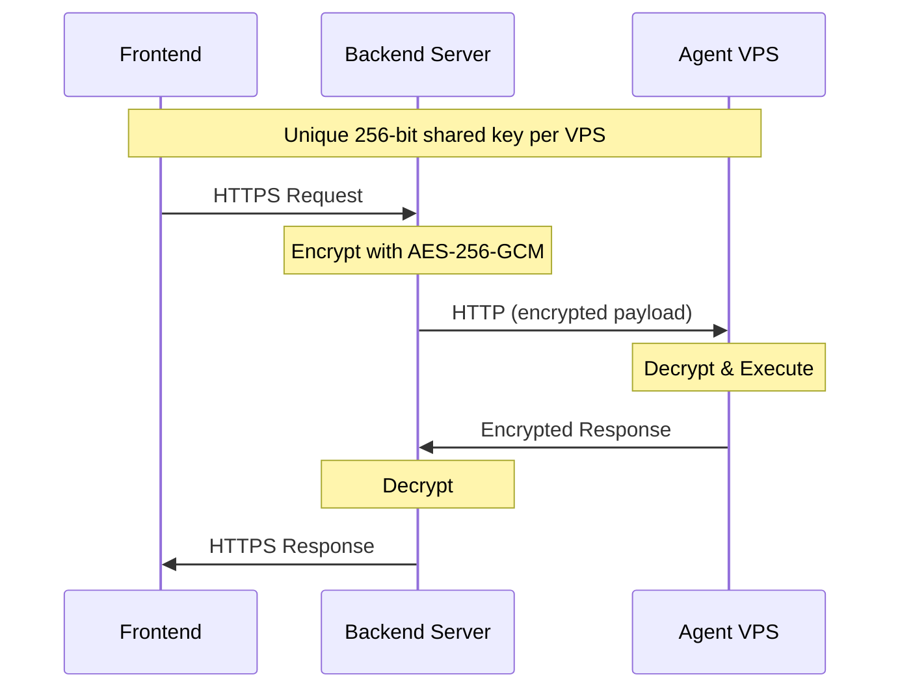

## Overview

When you create an agent in Ariana, it runs on a dedicated Virtual Private Server (VPS) provisioned specifically for your development needs. Each VPS comes with a complete development environment pre-installed, allowing you to start coding immediately without any setup.

<Note>
The VPS runs the **Ariana Agent Server**, which is an open-source component of Ariana. You can [install and connect](/agent-server/installation) the agent server from your own infrastructure if you prefer to use your own machines instead of our managed VPS.
</Note>

## SSH Access

Each VPS is secured with SSH key authentication using ED25519 keys, with root password authentication disabled for security. Terminals inside the Ariana desktop application connect directly to your VPS via SSH, giving you immediate command-line access. Only necessary ports are exposed (SSH, agent server, RustDesk), with all other incoming connections blocked by the firewall.

## Pre-installed Software

<CardGrid cols={5}>
  <Card icon="node-js" iconType="brands">
    **Node.js**
    v20, v22, v24
  </Card>
  <Card icon="python" iconType="brands">
    **Python**
    3.x + Poetry, uv
  </Card>
  <Card icon="golang" iconType="brands">
    **Go**
    1.23.4
  </Card>
  <Card icon="rust" iconType="brands">
    **Rust**
    Latest stable
  </Card>
  <Card icon="java" iconType="brands">
    **Java/JVM**
    OpenJDK 11 + Kotlin, Scala
  </Card>
  <Card icon="php" iconType="brands">
    **PHP**
    8.4 + Composer
  </Card>
  <Card icon="r-project" iconType="brands">
    **R**
    Base + dev tools
  </Card>
  <Card icon="code">
    **Elixir**
    + Erlang/OTP
  </Card>
  <Card icon="microsoft" iconType="brands">
    **.NET**
    SDK 8.0
  </Card>
  <Card icon="docker" iconType="brands">
    **Docker**
    Engine + Compose
  </Card>
</CardGrid>

### Languages and Tools

**10+ languages** with modern toolchains pre-installed.

- <Icon icon="node-js" iconType="brands" /> **JavaScript/TypeScript**: Node.js (v20, v22, v24 via nvm), Bun, Deno, npm, pnpm
- <Icon icon="python" iconType="brands" /> **Python**: Python 3, pip, venv, Poetry, uv (fast package manager)
- <Icon icon="golang" iconType="brands" /> **Go**: Go 1.23.4 with full toolchain
- <Icon icon="rust" iconType="brands" /> **Rust**: rustc, cargo, rust-analyzer
- <Icon icon="java" iconType="brands" /> **Java/JVM**: OpenJDK 11, Maven, Gradle, Kotlin, Scala
- <Icon icon="php" iconType="brands" /> **PHP**: PHP 8.4 with common extensions, Composer
- <Icon icon="r-project" iconType="brands" /> **R**: R base and R dev tools
- <Icon icon="code" /> **Elixir/Erlang**: Elixir, Erlang/OTP
- <Icon icon="microsoft" iconType="brands" /> **.NET**: .NET SDK 8.0

### Professional Tooling Included

- <Icon icon="robot" /> **Claude Code CLI** (pre-installed and configured)
- <Icon icon="git-alt" iconType="brands" /> **Version Control**: Git, GitHub CLI
- <Icon icon="docker" iconType="brands" /> **Docker**
- <Icon icon="hammer" /> **Build Tools**: gcc, g++, make, CMake, clang, ninja
- <Icon icon="image" /> **Multimedia**: ffmpeg, ImageMagick
- <Icon icon="desktop" /> **Desktop Environment**: Budgie Desktop with Chromium browser
- <Icon icon="screen-users" /> **Remote Access**: RustDesk for graphical desktop access
- <Icon icon="terminal" /> **Utilities**: screen, tree, zip/unzip, and more

### Full Capabilities

Each agent runs on a dedicated Ubuntu 24.04 LTS VPS with complete root access and no restrictions. Install any software, run any command. You have the same freedom as your local machine, without the setup overhead.

## Communication & Security

### Encrypted Communication

All communication between your application and the VPS is protected using AES-256-GCM encryption. Each VPS receives a unique 256-bit shared secret key during provisioning, ensuring that data is encrypted at the application layer before transmission. Every request includes an encrypted authentication token to prevent unauthorized access.

### How It Works

**Security:** Application-layer AES-256-GCM encryption with unique keys per VPS. Data encrypted before HTTP transport.

### Why It's Secure

- **End-to-End Encryption**: Data is encrypted before leaving your computer and decrypted only on the destination VPS
- **Unique Keys**: Each VPS has its own unique encryption key - compromising one doesn't affect others

## Machine Specifications

Each agent runs on a VPS with the following specifications:

| Specification | Details |
|---------------|---------|
| **vCPU** | 2 shared cores |
| **RAM** | 4 GB |
| **Storage** | 40 GB NVMe SSD |
| **Operating System** | Ubuntu 24.04 LTS |
| **Location** | Frankfurt, Germany (fsn1) |

## Cloud Provider

We use European cloud providers that best match our requirements, with Hetzner being our primary partner. Our infrastructure is hosted in data centers located in Germany and Finland.
