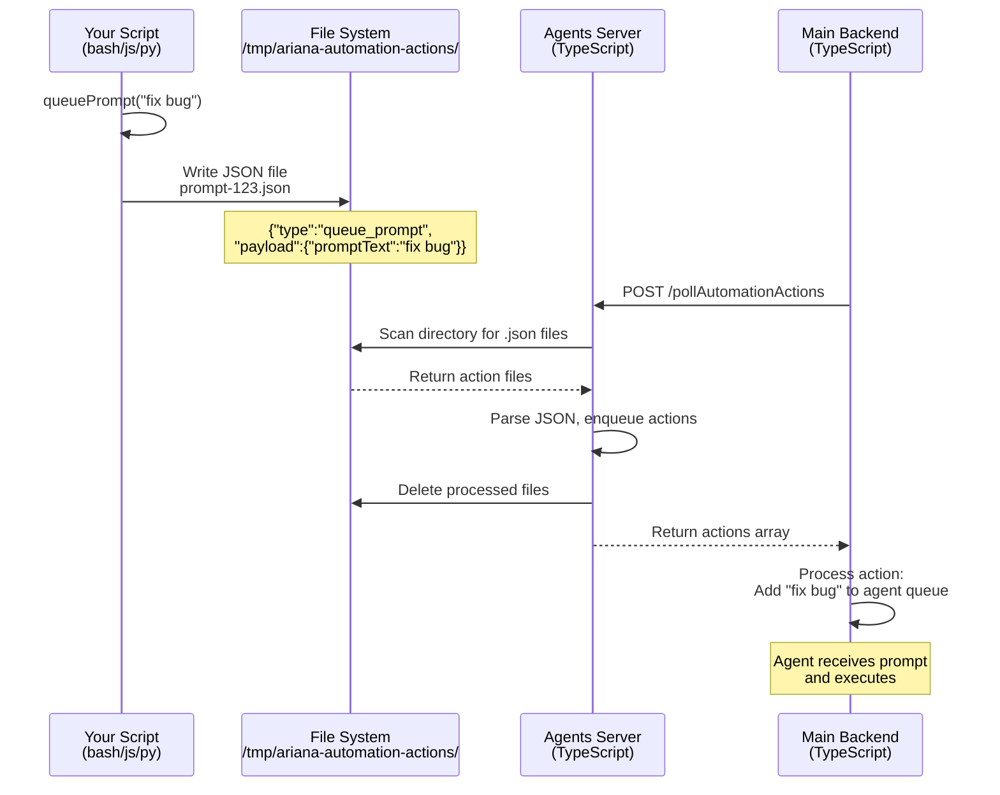

<Note>
Automations and [Environments](/essentials/environments) work together as a powerful system. Automations can access environment variables, and environments can bundle automations alongside configuration. We recommend reading both pages to understand the full capabilities.
</Note>

## Overview

Automations allow you to run custom scripts automatically in response to agent events. Write scripts in Bash, JavaScript, or Python that execute when the agent performs specific actions—like editing files, running commands, or creating commits.

Use automations to enforce code quality, run tests, validate changes, integrate with external tools, or orchestrate complex workflows. Scripts have access to rich context about what the agent is doing, including file paths, git diffs, conversation history, and more.

## Key Concepts

### Triggers

Automations respond to specific events in your agent's workflow:

| Trigger | Description |
|---------|-------------|
| **Manual** | Run on demand via command palette |
| **On agent ready** | Executes when agent is idle and waiting for input |
| **After edit files** | Runs when agent modifies files (optional glob filter) |
| **After read files** | Triggers when agent reads files (optional glob filter) |
| **After run command** | Executes after agent runs bash commands (optional regex filter) |
| **Before commit** | Runs before creating a git commit (always blocking, like a pre-commit hook) |
| **After commit** | Executes after a git commit is created |
| **After compaction** | Runs when conversation history is compacted |
| **After reset** | Triggers when agent is reset |
| **After automation finishes** | Chains automations together (runs after another automation completes) |

### Script Languages

Choose the language that best fits your task:

- <Icon icon="terminal" /> **Bash**: Best for shell commands, git operations, file manipulation
- <Icon icon="js" iconType="brands" /> **JavaScript**: Ideal for JSON processing, API calls, Node.js tools
- <Icon icon="python" iconType="brands" /> **Python**: Great for data processing, testing, complex logic

### Feed Output to Agent

When enabled, the script's stdout and stderr are sent to the agent as context. The agent receives the last 1000 lines of output, which helps with debugging and decision-making.

## Available Variables

<Tabs>
  <Tab title="Bash" icon="terminal">
    | Variable | Type | Description |
    |----------|------|-------------|
    | `$INPUT_FILE_PATH` | string | Path of file being edited or read |
    | `$INPUT_COMMAND` | string | Bash command being executed |
    | `$CURRENT_COMMIT_SHA` | string | SHA hash of current commit |
    | `$CURRENT_COMMIT_CHANGES` | string | Git diff of current commit |
    | `$CURRENT_PENDING_CHANGES` | string | Git diff of uncommitted changes |
    | `$ENTIRE_AGENT_DIFF` | string | All changes since agent started |
    | `$LAST_PROMPT` | string | Most recent user prompt |
    | `$ALL_LAST_PROMPTS` | string | All user prompts (newline-separated) |
    | `$CONVERSATION_TRANSCRIPT` | JSON | Full conversation history |
    | `$GITHUB_TOKEN` | string | GitHub authentication token (if available) |
  </Tab>
  <Tab title="JavaScript" icon="js" iconType="brands">
    | Variable | Type | Description |
    |----------|------|-------------|
    | `variables.inputFilePath` | string | Path of file being edited or read |
    | `variables.inputCommand` | string | Bash command being executed |
    | `variables.currentCommitSha` | string | SHA hash of current commit |
    | `variables.currentCommitChanges` | string | Git diff of current commit |
    | `variables.currentPendingChanges` | string | Git diff of uncommitted changes |
    | `variables.entireAgentDiff` | string | All changes since agent started |
    | `variables.lastPrompt` | string | Most recent user prompt |
    | `variables.allLastPrompts` | array | All user prompts |
    | `variables.conversationTranscript` | object | Full conversation history |
    | `variables.githubToken` | string | GitHub authentication token (if available) |
  </Tab>
  <Tab title="Python" icon="python" iconType="brands">
    | Variable | Type | Description |
    |----------|------|-------------|
    | `variables.inputFilePath` | string | Path of file being edited or read |
    | `variables.inputCommand` | string | Bash command being executed |
    | `variables.currentCommitSha` | string | SHA hash of current commit |
    | `variables.currentCommitChanges` | string | Git diff of current commit |
    | `variables.currentPendingChanges` | string | Git diff of uncommitted changes |
    | `variables.entireAgentDiff` | string | All changes since agent started |
    | `variables.lastPrompt` | string | Most recent user prompt |
    | `variables.allLastPrompts` | array | All user prompts |
    | `variables.conversationTranscript` | object | Full conversation history |
    | `variables.githubToken` | string | GitHub authentication token (if available) |
  </Tab>
</Tabs>

## Control Functions

Control functions allow your automation scripts to interact with and control the agent's behavior. These functions are automatically injected into your script's runtime environment and can be called directly without any imports or setup.

| Function | Parameters | Description |
|----------|------------|-------------|
| `stopAgent` | None | Immediately stops the agent execution. Use for critical validation failures. |
| `queuePrompt` | `message` (string) | Sends a prompt to the agent programmatically. |



## Example

### Pre-Commit TypeScript Type Checking

Run TypeScript type checking before every commit and block the commit if there are errors:

```bash
#!/bin/bash
# Trigger: on_before_commit
# Blocking: true
# Feed Output: true

echo "Running TypeScript type checking..."
npx tsc --noEmit

if [ $? -ne 0 ]; then
  echo "❌ TypeScript type check failed - commit blocked"
  stopAgent
  exit 1
fi

echo "✓ TypeScript type check passed"
```


